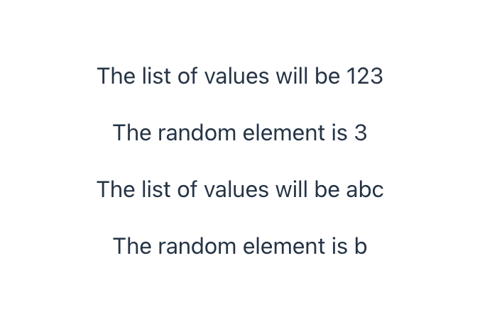
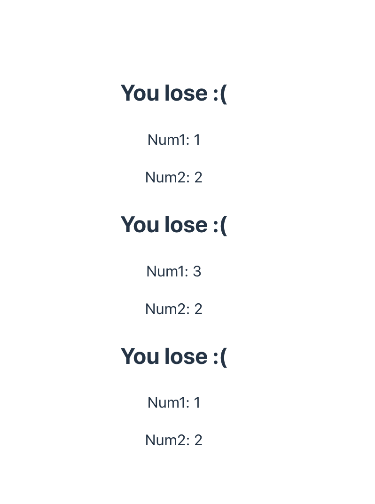

# Local installation

### Install react

Here below is guide


### Install react

Here below is guide for installation

```bash
npm create vite@latest
cd first-react-app
npm install
npm run dev
```


### More default props

```js
export default function Greeter({person="everyone", from="anonymous"}){
    return (
        <>
            <h1>Salem {person}!</h1>
            <h2>--{from} </h2>
        </>
    )
}
```

```js
function App() {
  return (
    <div>
      <Greeter person="Naruto" from="Jiraya"/>
      <Die numSides={20}/>

      <Greeter person="Sakura" from="Tsunade"/>
      <Die />

      <Greeter person="Sasuke" from="Orochimaru"/>
      <Die numSides={10}/>
          
      <Greeter person="Sai"/>
      <Die />
    </div>
  );
}
```


Here below is result 


### Passing arrays and objects to props

You can also pass arrays and objects to props

```js
export default function ListPicker({values}){
    const randIdx = Math.floor(Math.random() * values.length);
    const randElement = values[randIdx];

    return (
        <div>
            <p>The list of values will be {values}</p>
            <p>The random element is {randElement}</p>
        </div>
    );
}

function App() {
  return (
    <div>
      <ListPicker values={[1, 2, 3]}/>
      <ListPicker values={["a", "b", "c"]}/>
      <ListPicker values={[1, "x", undefined]}/>
    </div>
    );
}
```

Here below is result 




### React conditionals

Here is below example conditional logics outside of `return` function:

```js
export default function DoubleDice(){
    const num1 = Math.floor(Math.random() * 3) + 1;
    const num2 = Math.floor(Math.random() * 3) + 1;

    const result = num1 === num2 ? "You win xD" : "You lose :(";

    return (
        <div>
            <h2>{result}</h2>
            <p>Num1: {num1}</p>
            <p>Num2: {num2}</p>
        </div>
    );

}
```

Here below is result 



Here is below example conditional logics outside of `return` function:

```js
export default function DoubleDice(){
    const num1 = Math.floor(Math.random() * 3) + 1;
    const num2 = Math.floor(Math.random() * 3) + 1;

    return (
        <div>
            <h2>Double Dice</h2>
            {num1 === num2 ? <h3>"You win"</h3> : null}
            <p>Num1: {num1}</p>
            <p>Num2: {num2}</p>
        </div>
    );
}
```