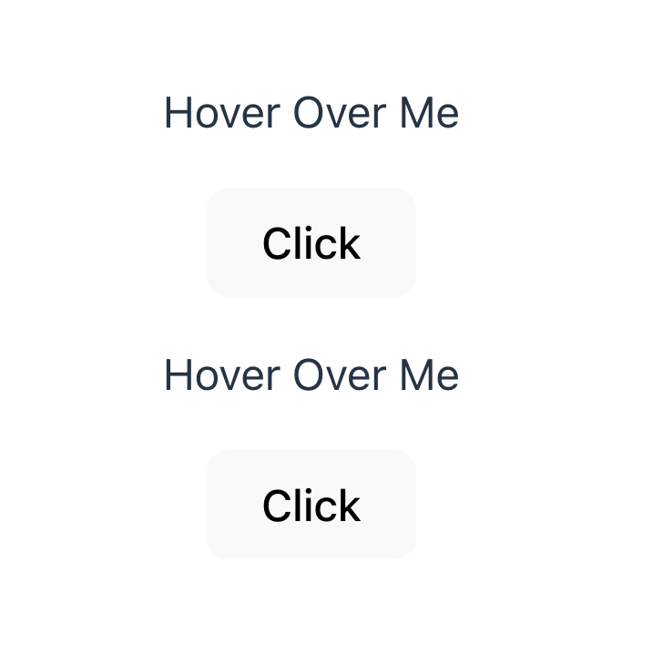

# Lesson 3

In React, events are interactions that occur within the application, such as mouse clicks, keyboard presses, or changes in form inputs. 

Handling events in React is similar to handling them in traditional HTML, but with some key differences due to React's synthetic event system and its approach to managing state.

### Event Handling:

Events in React are handled using JSX syntax by attaching event handlers to elements. Here’s an example of how you might handle a click event:

```js
function handleClick() {
  console.log('Button clicked!');
}

<button onClick={handleClick}>Click me</button>
```
In this example, handleClick is a function that will be called when the button is clicked.

### branch 1 - simple event

https://github.com/frontend-refresh/module-5/tree/lesson3-branch1

```js
function handleClick() {
    console.log("CLICKED THE BUTTON!!!");
  }
  
  export default function Clicker() {
    return (
      <div>
        <p>Hover Over Me</p>
        <button onClick={handleClick}>Click</button>
      </div>
    );
  }
// main code
function App() {
  return (
    <div>
      <Clicker />
      <Clicker />
    </div>
  );
}
```

Here below is result 




### branch 2 - mouseover

https://developer.mozilla.org/en-US/docs/Web/API/Element/mouseover_event
https://github.com/frontend-refresh/module-5/tree/lesson3-branch2

```js
function handleClick() {
    console.log("CLICKED THE BUTTON!!!");
  }
  
function handleHover() {
  console.log("HOVERED!!");
}

export default function Clicker() {
  return (
    <div>
      <p onMouseOver={handleHover}>Hover Over Me</p>
      <button onClick={handleClick}>Click</button>
      <button
        onClick={() =>
          console.log("CLICKED THE INLINE ARROW FUNCTION VERSION!")
        }
      >
        Inline Function (CLICK ME!)
      </button>
    </div>
  );
}

```

Here below is result 


